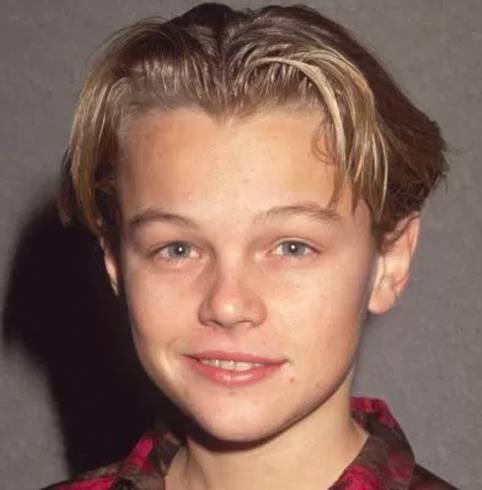
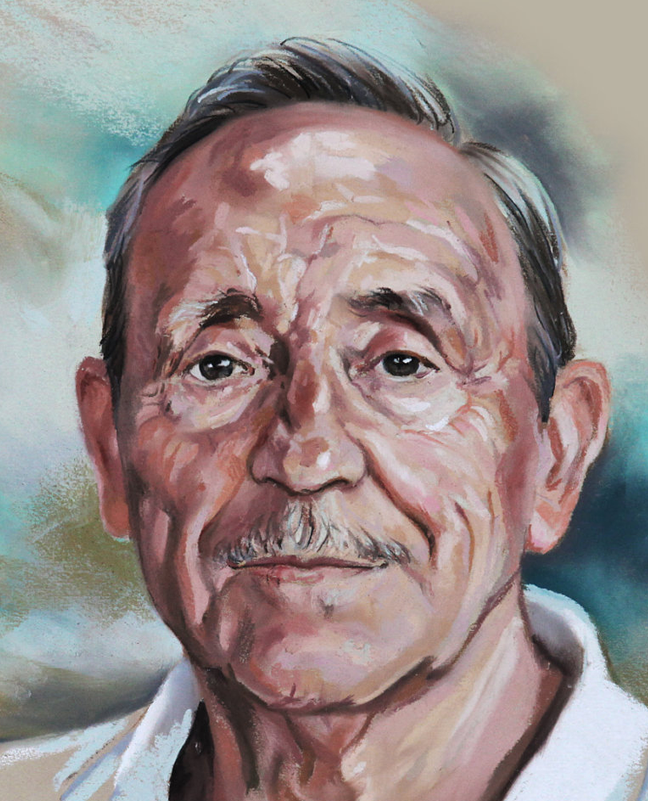
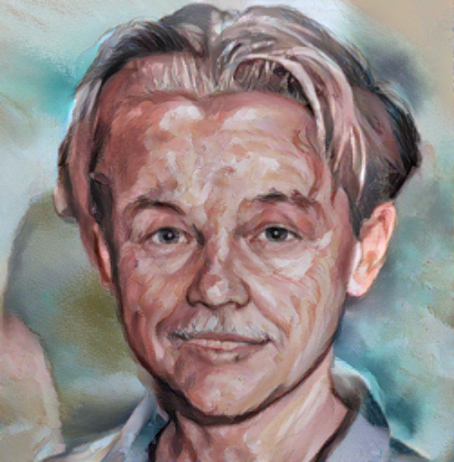

# fast-strotss
A complete faster version of the STROTSS including mask guidance (based on David Futschik's repo https://github.com/futscdav/strotss and Nick Kolkin's original work https://github.com/nkolkin13/STROTSS).

Usage:
```
python strotss.py <content> <style> [--weight 1.0] [--output strotss.png] [--device "cuda:0"] [--content_mask <path_to_content_mask>] [--style_mask <path_to_style_mask>]
```

<p align="center">
  
  
  
</p>
